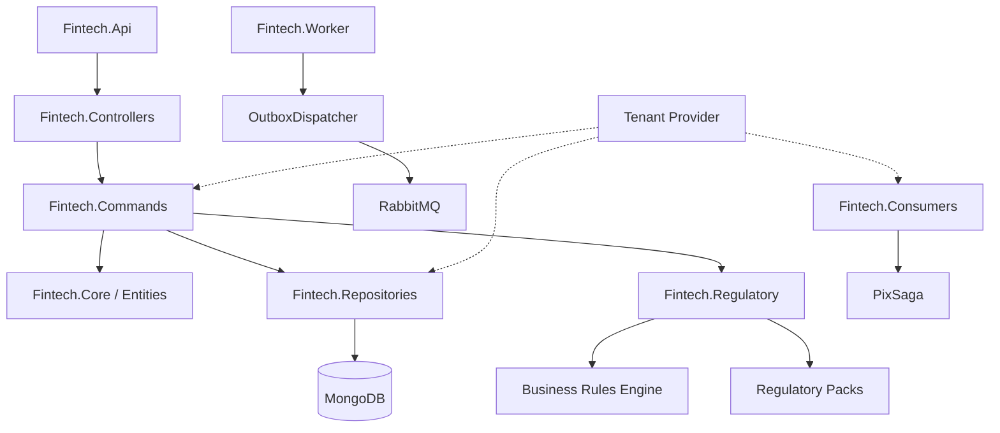

# 🏦 D.AI Bank - Project Tenet

**Versão:** 2.0.0 (Tenet Architecture) | **Desenvolvido por:** LuckArkman | **Data:** Janeiro 2026

[](https://dotnet.microsoft.com/download/dotnet/8.0)
[](https://www.mongodb.com/)
[](https://redis.io/)
[](https://www.rabbitmq.com/)
[](https://www.docker.com/)

> **Plataforma Global de Infraestrutura Fintech Modular e Extensível**, desenvolvida em .NET 8 seguindo a arquitetura **Project Tenet** - uma infraestrutura bancária capaz de suportar múltiplos modelos de negócio, regulamentações nacionais e perfis operacionais a partir de uma base tecnológica única, estável e reutilizável.

---

## 📑 Índice

- [🌍 Project Tenet - Visão Geral](#-project-tenet---visão-geral)
- [🚀 Destaques Tecnológicos](#-destaques-tecnológicos)
- [🏗️ Arquitetura do Sistema](#️-arquitetura-do-sistema)
- [🛠️ Stack Técnica](#️-stack-técnica)
- [🚦 Como Iniciar](#-como-iniciar)
- [🎯 Funcionalidades Implementadas](#-funcionalidades-implementadas)
- [🌐 Multi-Tenancy e Regulatory Framework](#-multi-tenancy-e-regulatory-framework)
- [📊 Business Rules Engine](#-business-rules-engine)
- [🔒 Segurança](#-segurança-implementada)
- [☁️ Infraestrutura AWS](#-infraestrutura-terraform)
- [🧪 Testes](#-testes)
- [📚 Documentação Adicional](#-documentação-adicional)

---

## 🌍 Project Tenet - Visão Geral

**Project Tenet** transforma o D.AI Bank em uma **infraestrutura fintech global**, permitindo que clientes Tenet criem e operem suas próprias fintechs em diferentes países com configurações regulatórias, fiscais, legais e operacionais customizadas, sem mudanças profundas no sistema core.

### Princípios Arquiteturais

1. **Modularidade Estrutural**: Sistema organizado em módulos independentes, desacoplados e versionáveis
2. **Multimodalidade Funcional**: Suporte a diversos modos operacionais (Banco Digital, Instituição de Pagamento, Exchange Cripto, etc.)
3. **Internacionalização Nativa (Global-First)**: Suporte a múltiplas jurisdições, regras fiscais, idiomas, moedas e fusos horários
4. **Core Imutável (Tenet Core)**: Funcionalidades universais e não-regulatórias
5. **Módulos Regulatórios por País (Regulatory Packs)**: Regras específicas de cada país encapsuladas em pacotes dinâmicos
6. **Compliance by Design**: Logs imutáveis, trilhas de auditoria, versionamento regulatório

### Modos de Negócio Suportados

- 🏦 **Digital Bank**: Banco digital completo
- 💳 **Payment Institution**: Instituição de pagamento
- 🪙 **Crypto Exchange**: Exchange de criptomoedas
- 🏪 **Neobank**: Neobanco com serviços especializados
- 💰 **Wallet Provider**: Provedor de carteira digital
- 🌐 **Remittance Service**: Serviço de remessas internacionais

### Jurisdições Suportadas

- 🇧🇷 Brazil (Bacen Rules)
- 🇺🇸 United States (BSA & Regulation E)
- 🇬🇧 United Kingdom (FCA & Faster Payments)
- 🇪🇺 European Union (AMLD5 & SEPA)
- 🇨🇦 Canada
- 🇦🇺 Australia
- 🇯🇵 Japan
- 🇸🇬 Singapore
- 🇲🇽 Mexico
- 🇦🇷 Argentina

---

## 🚀 Destaques Tecnológicos

### 🛡️ Resiliência e Consistência

- **Idempotência Nativa**: Middleware e serviços dedicados garantem que nenhuma transação seja processada em duplicidade
- **Saga Pattern (Orchestration)**: Gerenciamento de transações distribuídas complexas (ex: Fluxo de Pix)
- **Outbox Pattern**: Garante a entrega confiável de mensagens para o broker (RabbitMQ)
- **Double-Entry Bookkeeping (Ledger)**: Todas as movimentações geram registros de débito e crédito imutáveis
- **Optimistic Concurrency Control**: Controle de versão em nível de entidade para evitar race conditions

### 🌐 Multi-Tenancy Nativo

- **Isolamento de Dados por Tenant**: Todos os repositórios filtram automaticamente por `TenantId`
- **Tenant Provider**: Extração de contexto via HTTP headers (`X-Tenant-Id`) ou JWT claims
- **Perfil Institucional**: Cada tenant possui jurisdições ativas, modos de negócio e configurações regulatórias

### 📜 Regulatory Framework

- **Regulatory Packs**: Pacotes de regras específicas por país (validações, limites, impostos)
- **Regulatory Registry**: Registro dinâmico de packs regulatórios
- **Regulatory Service**: Orquestração de validações regulatórias em múltiplas jurisdições
- **Compliance Controller**: API para ativação/desativação de jurisdições

### 🧠 Business Rules Engine

- **Avaliação Declarativa de Regras**: Engine baseado em DynamicExpresso para regras em runtime
- **Regras Configuráveis**: Expressões condicionais, mensagens de erro, níveis de severidade
- **Integração com Regulatory Packs**: Regras regulatórias aplicadas dinamicamente

### 🧪 Engenharia de Caos (Chaos Engineering)

O sistema inclui um simulador de SPI (Sistema de Pagamentos Instantâneos) que injeta falhas controladas:
- **Latência Injetada**: 10% das requisições sofrem timeout proposital
- **Falhas Intermitentes**: 15% de erro 500 para testar circuitos de retentativa
- **Rejeições de Negócio**: Simulação de chaves inexistentes e erros de validação

### 📊 Observabilidade e Telemetria

Implementação profunda de **OpenTelemetry**, permitindo rastreamento ponta-a-ponta (Distributed Tracing), métricas de performance e logs estruturados integrados ao Prometheus.

---

## 🏗️ Arquitetura do Sistema

O projeto segue os princípios da **Clean Architecture** com **Domain-Driven Design** e **Event-Driven Architecture**:



### Principais Componentes

#### Core Infrastructure
- **`Fintech.Api`**: Entry point do sistema, configurações de DI, Middlewares
- **`Fintech.Commands`**: Handlers de negócio (Debit, Transfer, SendPix)
- **`Fintech.Persistence`**: Implementação do `MongoContext` com suporte a transações
- **`Fintech.Messaging`**: Cliente RabbitMQ abstraído
- **`Fintech.Worker`**: Processos de background (Outbox, Ledger archiving)

#### Tenet Architecture
- **`Fintech.Regulatory`**: Framework regulatório com packs por país
- **`Fintech.Regulatory.Rules`**: Business Rules Engine
- **`Fintech.Regulatory.Packs`**: Implementações de regulatory packs (Brazil, US, EU, etc.)
- **`Fintech.Enums.TenetEnums`**: Enums para BusinessMode e Jurisdiction

#### Multi-Tenancy
- **`ITenantProvider`**: Interface para resolução de tenant
- **`TenantProvider`**: Implementação que extrai TenantId de headers/JWT
- **`Tenant Entity`**: Perfil institucional com jurisdições e modos ativos

---

## 🛠️ Stack Técnica

### Backend
- **Linguagem**: C# (.NET 8)
- **Framework**: ASP.NET Core Web API
- **Banco de Dados**: MongoDB (Persistência Principal)
- **Caching**: Redis (Idempotência e Cache de Aplicação)
- **Mensageria**: RabbitMQ (Event-Driven Design)
- **Infraestrutura**: Docker & Terraform

### Libraries Principais
- **MongoDB.Driver**: Acesso ao MongoDB com suporte a transações
- **StackExchange.Redis**: Cliente Redis
- **RabbitMQ.Client**: Cliente RabbitMQ
- **BCrypt.Net**: Hash de senhas
- **System.IdentityModel.Tokens.Jwt**: Autenticação JWT
- **DynamicExpresso.Core**: Avaliação de expressões em runtime
- **OpenTelemetry**: Observabilidade e métricas
- **Polly**: Resiliência e retry policies

### Testing
- **xUnit**: Framework de testes
- **FluentAssertions**: Assertions fluentes
- **Moq**: Mocking framework
- **NetArchTest**: Testes de arquitetura

---

## 🚦 Como Iniciar

### Pré-requisitos
- Docker & Docker Compose
- SDK do .NET 8 (opcional para desenvolvimento local)

### Execução via Docker

Para subir todo o ecossistema (API, MongoDB, Redis, RabbitMQ):

```bash
docker-compose up -d
```

### Configuração de Ambiente

As configurações de conexão podem ser encontradas em:
- `Fintech.Api/appsettings.json`
- `Fintech.Api/Program.cs` (Registro de dependências)

### Build e Testes

```bash
# Build da solução
dotnet build

# Executar testes unitários
dotnet test Fintech.UnitTests/Fintech.UnitTests.csproj

# Executar testes de integração
dotnet test Fintech.IntegrationTests/Fintech.IntegrationTests.csproj

# Executar API localmente
dotnet run --project Fintech.Api/Fintech.Api.csproj
```

---

## 🎯 Funcionalidades Implementadas

### 1. Autenticação e Gestão de Usuários

**Registro de Usuários** (`AuthController.cs`, `AuthService.cs`)
- Criação de conta com validação de email único
- Hash seguro de senha usando BCrypt
- Abertura automática de conta bancária vinculada
- Geração de token JWT com claims personalizados (incluindo TenantId)
- Registro no Ledger da criação da conta

**Login e Autenticação**
- Autenticação via email/senha
- Validação de credenciais com BCrypt.Verify
- Emissão de JWT com expiração de 8 horas
- Claims incluem: UserId, Email, Name, AccountId, Role, TenantId

**Controle de Acesso**
- Middleware de autenticação JWT
- Autorização baseada em roles (Client, Admin)
- HttpContextCurrentUser para injeção de contexto
- Proteção de endpoints via [Authorize]

---

### 2. Operações Bancárias Core

**Gestão de Contas** (`Account.cs`, `AccountRepository.cs`)
- Entidade Account com suporte multi-moeda
- Balances armazenado como Dictionary<string, Money>
- Controle de versão otimista (Version field)
- Métodos Debit() e Credit() com validações
- **Multi-tenancy**: Todas as contas vinculadas a um TenantId

**Consulta de Saldo** (`AccountController.cs`)
- Endpoint GET /api/v1/accounts/balance
- Retorna saldo da conta autenticada
- Acesso via token JWT (AccountId do claim)
- Suporte a múltiplas moedas (BRL, USD)

**Extrato Bancário** (`GetStatementHandler.cs`)
- Endpoint GET /api/v1/accounts/statement
- Consulta histórico de transações no Ledger
- Filtrado automaticamente por TenantId

---

### 3. Transferências e Movimentações

**Transferência Interna** (`TransferFundsHandler.cs`)
- Transferência entre contas do mesmo banco
- **Validação Regulatória**: Integração com `IRegulatoryService`
- Transação MongoDB com garantia ACID
- Validação de saldo insuficiente
- Registro duplo no Ledger (débito + crédito)
- CorrelationId para rastreamento
- Optimistic Concurrency Control

**Débito em Conta** (`DebitAccountHandler.cs`)
- Operação de débito com validação
- Integração com Outbox Pattern
- Publicação de evento "AccountDebited"
- Métricas de volume e taxa de sucesso
- Idempotência via middleware

**Depósito** (`DepositHandler.cs`)
- Operação de crédito em conta
- Registro no Ledger com TenantId
- Validação de valores positivos

---

### 4. Sistema PIX Completo

**Gerenciamento de Chaves PIX** (`PixKey.cs`, `PixKeyController.cs`)
- Registro de chaves PIX (CPF, Email, Telefone, Aleatória)
- Validação de unicidade de chaves
- **Multi-tenancy**: Chaves isoladas por tenant
- Endpoint POST /api/v1/pix/keys
- Endpoint GET /api/v1/pix/keys (listagem)

**Envio de PIX - Saga Distribuída** (`SendPixHandler.cs`, `PixOrchestrator.cs`)

**Fluxo Completo:**
1. **Created**: Cliente solicita PIX
   - Cria PixSaga com status "Created" e TenantId
   - Valida dados básicos
   
2. **BalanceLocked**: Reserva de saldo
   - Debita valor da conta origem
   - Atualiza saga para "BalanceLocked"
   - Publica evento no Outbox com TenantId
   
3. **Processing**: Comunicação com SPI
   - PixGateway envia para sistema externo
   - Aguarda confirmação
   
4. **Completed/Failed**: Finalização
   - Sucesso: Marca saga como "Completed"
   - Falha: Executa compensação (refund) com registro no Ledger

**Compensação Automática** (`PixProcessConsumer.cs`)
- Método InitiateRefund() com suporte a multi-tenancy
- Estorna valor em caso de falha
- Marca saga como "Refunded"
- Registra no Ledger com TenantId correto

---

### 5. Cartões e Empréstimos

**Emissão de Cartões** (`IssueCardHandler.cs`)
- Validação de modo de negócio (BusinessMode)
- Verifica se tenant tem modo "DigitalBank" ou "PaymentInstitution" ativo
- Criação de cartão virtual/físico
- Integração com processadoras

**Gestão de Empréstimos** (`LoanRepository.cs`)
- Solicitação de empréstimos
- Análise de crédito
- Aprovação/Rejeição
- Filtrado por TenantId

**Investimentos** (`InvestmentRepository.cs`)
- Produtos de investimento
- Rentabilidade
- Resgate
- Isolamento por tenant

---

### 6. Ledger e Auditoria

**Sistema de Ledger Imutável** (`LedgerEvent.cs`, `LedgerRepository.cs`)
- Registro de todas as movimentações
- **Multi-tenancy**: Todos os eventos incluem TenantId
- Campos obrigatórios:
  - AccountId
  - TenantId
  - Type (DEBIT, CREDIT, TRANSFER_SENT, etc)
  - Amount
  - CorrelationId
  - Timestamp
- Campos opcionais:
  - BalanceAfter (snapshot)
  - Metadata (IP, device, etc)

**Rastreabilidade**
- CorrelationId único por transação
- Permite reconstruir fluxo completo
- Auditoria para compliance
- Suporte a LGPD

---

### 7. Outbox Pattern

**Garantia de Entrega** (`OutboxMessage.cs`, `OutboxRepository.cs`)
- Mensagens persistidas na mesma transação
- **Multi-tenancy**: Mensagens incluem TenantId
- Campos:
  - Topic (routing key)
  - PayloadJson (evento serializado)
  - TenantId
  - ProcessedAt (null = pendente)
  - CreatedAt

**Worker de Processamento** (`OutboxWorker.cs`)
- Background service que roda a cada 5 segundos
- Busca até 20 mensagens pendentes
- Publica no RabbitMQ
- Marca como processada
- Retry automático em caso de falha

---

### 8. Idempotência

**Middleware de Idempotência** (`IdempotencyMiddleware.cs`)
- Header "Idempotency-Key" obrigatório para POST/PUT/DELETE
- Cache Redis com TTL de 24 horas
- Retorna resposta cacheada se chave já existe
- Buffering de response para cachear resultado
- Apenas respostas 2xx são cacheadas

---

## 🌐 Multi-Tenancy e Regulatory Framework

### Tenant Provider

**ITenantProvider** (`ITenantProvider.cs`, `TenantProvider.cs`)
- Extração de TenantId de HTTP headers (`X-Tenant-Id`)
- Fallback para JWT claims
- Injetado em todos os handlers e repositórios

### Tenant Entity

**Perfil Institucional** (`Tenant.cs`)
```csharp
public class Tenant
{
    public Guid Id { get; private set; }
    public string Name { get; private set; }
    public string Identifier { get; private set; }
    public TenantBranding Branding { get; private set; }
    public List<Jurisdiction> ActiveJurisdictions { get; private set; }
    public List<BusinessMode> ActiveModes { get; private set; }
    public Dictionary<string, string> RegulatoryConfig { get; private set; }
    public bool IsActive { get; private set; }
}
```

### Regulatory Framework

**IRegulatoryPack** (`IRegulatoryPack.cs`)
```csharp
public interface IRegulatoryPack
{
    Jurisdiction Jurisdiction { get; }
    Task<ValidationResult> ValidateTransactionAsync(Account account, decimal amount, string operationType);
    Task<ValidationResult> ValidateOnboardingAsync(User user);
    decimal CalculateTax(decimal amount, string operationType);
}
```

**BrazilRegulatoryPack** (`BrazilRegulatoryPack.cs`)
- Limite de transferência noturna (Regra BACEN): R$ 1.000 entre 20h e 6h
- Validação de documentos obrigatórios (CPF)
- Cálculo de IOF e IR sobre investimentos
- Integração com Business Rules Engine

**RegulatoryService** (`RegulatoryService.cs`)
- Orquestra validações em múltiplas jurisdições
- Aplica regulatory packs ativos do tenant
- Retorna resultado consolidado

**Compliance Dashboard & Reports** (`ComplianceReportingService.cs`, `CompliancePage.tsx`)
- Dashboard premium com visualização de métricas regulatórias.
- Geração de relatórios baseados em dados reais do Ledger.
- Identificação automática de transações suspeitas (Flagged Events).
- Gestão de prazos e deadlines regulatórios.

---

### 9. Suporte Multi-Moeda e Fuso Horário

**Global Ledger** (`LedgerEvent.cs`)
- Suporte nativo a `CurrencyCode` em todos os registros.
- Auditoria precisa de transações cross-border.

**Tenant Localization** (`Tenant.cs`)
- Cada Tenant define sua moeda padrão e fuso horário operacional.
- Suporte a conversão via `CurrencyExchangeService`.

---

### 10. Módulos de Produto

**Crypto Wallet** (`CryptoService.cs`, `CryptoController.cs`)
- Compra e venda de ativos digitais (BTC, ETH, SOL).
- Gestão de saldos de criptoativos isolados por Tenant.
- Geração de endereços de carteira simulados.

**Cards & Loans** (`ProductModules/*.cs`)
- Inicialização dinâmica de módulos durante o onboarding do Tenant.
- Extensibilidade para novos instrumentos financeiros.

---

## 📊 Business Rules Engine

### Arquitetura

**IBusinessRulesEngine** (`BusinessRule.cs`)
```csharp
public interface IBusinessRulesEngine
{
    Task<RuleExecutionResult> EvaluateAsync(string expression, object context);
}
```

**BusinessRule Entity**
```csharp
public class BusinessRule
{
    public string Id { get; set; }
    public string Name { get; set; }
    public string Description { get; set; }
    public string ConditionExpression { get; set; } // "amount > 1000 && hour > 20"
    public string ErrorMessage { get; set; }
    public RuleSeverity Severity { get; set; }
}
```

**Severidade de Regras**
- **Information**: Informativo
- **Warning**: Alerta
- **Error**: Erro (bloqueia operação)
- **Blocking**: Bloqueio crítico

### Implementação

**BusinessRulesEngine** (`BusinessRulesEngine.cs`)
- Usa **DynamicExpresso** para avaliação de expressões em runtime
- Suporta expressões C# complexas
- Injeção de contexto como variáveis
- Tratamento de erros robusto

### Exemplo de Uso

```csharp
var rule = new BusinessRule
{
    Name = "Limite Noturno BACEN",
    ConditionExpression = "ctx.Amount > 1000 && (ctx.Hour >= 20 || ctx.Hour < 6)",
    ErrorMessage = "Transferências acima de R$ 1.000 não são permitidas entre 20h e 6h",
    Severity = RuleSeverity.Blocking
};

var context = new { Amount = 1500m, Hour = 22 };
var result = await rulesEngine.EvaluateAsync(rule.ConditionExpression, context);
```

---

## 🔒 Segurança Implementada

### Autenticação
- JWT com HMAC-SHA256
- Secret configurável
- Expiração de 8 horas
- Claims customizados (incluindo TenantId)

### Autorização
- Role-based (Client, Admin)
- [Authorize] attribute
- ICurrentUser para contexto
- Isolamento por tenant

### Criptografia
- BCrypt para senhas (salt automático)
- TLS para comunicação (configurável)

### Validações
- Email único
- Saldo insuficiente
- Valores positivos
- Tipos de chave PIX
- **Validações regulatórias por jurisdição**

### Compliance
- Logs imutáveis de auditoria
- Versionamento de regulatory packs
- Geração automática de evidências
- Relatórios regulatórios automatizados
- Dashboard de saúde de compliance (98.2% Health Score target)

---

## ☁️ Infraestrutura (Terraform)

### Recursos AWS (`main.tf`)

**VPC e Networking**
- VPC: 10.0.0.0/16
- Subnets públicas/privadas

**DocumentDB (MongoDB)**
- Cluster identifier: fintech-db-cluster
- Master username: fintechadmin
- Backup retention: 5 dias
- Backup window: 07:00-09:00

**ElastiCache (Redis)**
- Cluster ID: fintech-redis
- Engine: redis
- Node type: cache.t3.micro
- Port: 6379

**Amazon MQ (RabbitMQ)**
- Broker name: fintech-messaging
- Engine: RabbitMQ 3.10.20
- Instance type: mq.t3.micro
- User: fintechuser

**ECS Cluster**
- Name: DAIBank-Cluster
- Fargate launch type

---

## 🧪 Testes

### Status Atual
✅ **13/13 testes unitários passando**

### Tipos Implementados

1. **UnitTests**: Lógica de domínio
   - AccountTests
   - DebitAccountHandlerTests
   - TransferFundsHandlerTests
   - AuthServiceTests
   - CreateAccountHandlerTests

2. **IntegrationTests**: Fluxos completos
   - Testes de persistência
   - Testes de transação
   - Testes de messaging

3. **ArchitectureTests**: Validação de camadas (NetArchTest)
   - Dependências entre camadas
   - Acoplamento
   - Convenções de nomenclatura

4. **LoadTests**: Performance e throughput
   - Benchmarks de latência
   - Testes de carga

### Chaos Engineering
- Simulador SPI com falhas controladas
- Testes de resiliência
- Validação de retry e compensação

---

## 📚 Documentação Adicional

### Documentos do Projeto

- **[TENET_MANIFESTO.md](./TENET_MANIFESTO.md)**: Princípios arquiteturais do Project Tenet
- **[TENET_IMPLEMENTATION_STATUS.md](./TENET_IMPLEMENTATION_STATUS.md)**: Status detalhado da implementação
- **[SECURITY_AND_IMPLEMENTATION_ROADMAP.md](./SECURITY_AND_IMPLEMENTATION_ROADMAP.md)**: Análise de segurança e roadmap

### Endpoints Principais (API)

#### Autenticação
| Método | Endpoint | Descrição |
| :--- | :--- | :--- |
| `POST` | `/api/v1/auth/register` | Registro de novo usuário |
| `POST` | `/api/v1/auth/login` | Login e geração de JWT |

#### Contas
| Método | Endpoint | Descrição |
| :--- | :--- | :--- |
| `GET` | `/api/v1/accounts/balance` | Consulta de saldo |
| `GET` | `/api/v1/accounts/statement` | Extrato bancário |

#### Transferências
| Método | Endpoint | Descrição |
| :--- | :--- | :--- |
| `POST` | `/api/v1/transfer` | Transferência interna |
| `POST` | `/api/v1/transfer/debit` | Débito em conta |
| `POST` | `/api/v1/transfer/deposit` | Depósito |

#### PIX
| Método | Endpoint | Descrição |
| :--- | :--- | :--- |
| `POST` | `/api/v1/pix/keys` | Registrar chave PIX |
| `GET` | `/api/v1/pix/keys` | Listar chaves PIX |
| `POST` | `/api/v1/pix/send` | Enviar PIX |

#### Tenet Compliance
| Método | Endpoint | Descrição |
| :--- | :--- | :--- |
| `GET` | `/api/v1/tenet/compliance/active-packs` | Listar packs regulatórios ativos |
| `POST` | `/api/v1/tenet/compliance/activate-jurisdiction/{jurisdiction}` | Ativar jurisdição |

#### Tenants
| Método | Endpoint | Descrição |
| :--- | :--- | :--- |
| `GET` | `/api/v1/tenants` | Listar tenants |
| `POST` | `/api/v1/tenants` | Criar novo tenant |
| `GET` | `/api/v1/tenants/{id}` | Obter tenant por ID |

---

## 🎯 Diferenciais Técnicos

### Arquitetura Tenet
✅ Multi-tenancy nativo  
✅ Regulatory packs dinâmicos  
✅ Business rules engine declarativo  
✅ Suporte a múltiplas jurisdições  
✅ Modos de negócio configuráveis  

### Resiliência
✅ Saga Pattern com compensação  
✅ Outbox Pattern para garantia de entrega  
✅ Optimistic Concurrency Control  
✅ Retry automático  
✅ Chaos Engineering  

### Consistência
✅ Transações ACID (MongoDB)  
✅ Double-Entry Ledger  
✅ Idempotência nativa  
✅ Event Sourcing (parcial)  

### Escalabilidade
✅ Stateless APIs  
✅ Cache distribuído  
✅ Async processing  
✅ Horizontal scaling ready  
✅ Multi-tenant data isolation  

### Observabilidade
✅ Distributed tracing  
✅ Métricas de negócio  
✅ Logs estruturados  
✅ Correlation IDs  

---

## 📋 Checklist de Funcionalidades

### ✅ Core Banking
- [x] Registro e login de usuários
- [x] Autenticação JWT com TenantId
- [x] Gestão de contas multi-tenant
- [x] Consulta de saldo
- [x] Transferências internas com validação regulatória
- [x] Débito/Crédito
- [x] Chaves PIX (CRUD)
- [x] Envio de PIX (Saga)
- [x] Ledger imutável com TenantId
- [x] Outbox Pattern
- [x] Idempotência

### ✅ Project Tenet
- [x] Multi-tenancy infrastructure
- [x] Tenant Provider (HTTP headers + JWT)
- [x] Repository filtering por TenantId
- [x] Regulatory Framework
- [x] Regulatory Packs (Brazil implementado)
- [x] Regulatory Service
- [x] Business Rules Engine
- [x] Compliance Controller
- [x] BusinessMode e Jurisdiction enums
- [x] Tenant Entity com perfil institucional

### ✅ Infraestrutura
- [x] Métricas Prometheus
- [x] Chaos Engineering
- [x] Optimistic Concurrency
- [x] Infrastructure as Code (Terraform)
- [x] Health checks
- [x] Circuit breaker
- [x] Rate limiting
- [x] CORS configurado
- [x] Índices MongoDB

### ✅ Segurança e Compliance
- [x] Multi-factor authentication (MFA)
- [x] Notificações (email, SMS)
- [x] Dashboard administrativo
- [x] Open Banking (API v1)
- [x] Detecção de fraudes (ML Simulator)
- [x] Audit trails imutáveis
- [x] Regulatory versioning

### 🔄 Roadmap

#### Próximas Implementações
- [x] Currency & Time Zone Support
- [x] Additional Regulatory Packs (US, EU, UK)
- [x] Rule Repository (persistent storage)
- [x] Rule Management UI
- [x] Compliance Dashboard
- [x] Automated Regulatory Reporting
- [x] Product Modules (Crypto Wallet, Cards, Loans)
- [x] Tenant Onboarding Workflow
- [x] Performance Optimization (Redis caching, MongoDB indexing)

#### Próximas Implementações
- [x] Real-time KYC/Identity Verification adaptors
- [x] SWIFT and SEPA Real Settlement integration
- [x] AI-Driven Fraud Prediction (Advanced Model)
- [x] Variable Taxation Engine by Jurisdiction

---

## 🎓 Conclusão

O **D.AI Bank - Project Tenet** representa uma evolução significativa em infraestrutura fintech, oferecendo:

- **Arquitetura Global-First**: Suporte nativo a múltiplas jurisdições e regulamentações
- **Modularidade Extrema**: Regulatory packs e business modes configuráveis
- **Compliance by Design**: Auditoria, versionamento e evidências automáticas
- **Escalabilidade Infinita**: Multi-tenancy com isolamento completo de dados
- **Resiliência Bancária**: Padrões avançados (Saga, Outbox, Optimistic Locking)
- **Observabilidade Total**: Métricas, logs, tracing e correlation IDs

O projeto está pronto para operar como uma **plataforma fintech global**, permitindo que clientes Tenet criem e operem suas próprias instituições financeiras em diferentes países com configurações customizadas, sem mudanças no core do sistema.

---

**Desenvolvido por:** LuckArkman  
**Tecnologia:** .NET 8, MongoDB, Redis, RabbitMQ, DynamicExpresso  
**Arquitetura:** Project Tenet, Clean Architecture, DDD, Event-Driven, Multi-Tenant  
**Status:** ✅ Global Settlement & AI-KYC Complete (v2.2.0)  
**Próximo Milestone:** Digital Banking expansion & Cross-border liquidity pools

---

## 📞 Suporte e Contribuição

Para mais informações sobre a arquitetura Tenet, consulte:
- [TENET_MANIFESTO.md](./TENET_MANIFESTO.md) - Visão e princípios
- [TENET_IMPLEMENTATION_STATUS.md](./TENET_IMPLEMENTATION_STATUS.md) - Status detalhado

**Licença:** Uso comercial permitido  
**Versão:** 2.0.0 (Tenet Architecture)  
**Data de Release:** Janeiro 2026
