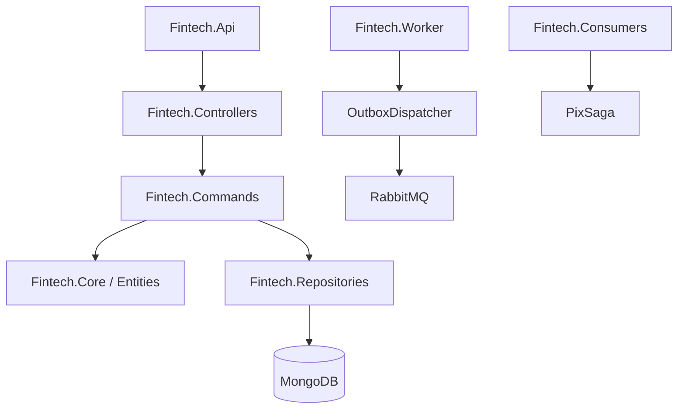

# 🏦 D.AI Bank - Core Banking Engine

[](https://dotnet.microsoft.com/download/dotnet/8.0)
[](https://www.mongodb.com/)
[](https://redis.io/)
[](https://www.rabbitmq.com/)
[](https://www.docker.com/)

O **D.AI Bank** é uma engine de Core Banking de alta performance e extrema resiliência, desenvolvida em .NET 8. O projeto foi arquitetado seguindo os padrões mais rigorosos da indústria financeira, garantindo consistência eventual, processamento assíncrono e proteção contra falhas catastróficas.

---

## 🚀 Destaques Tecnológicos

### 🛡️ Resiliência e Consistência
*   **Idempotência Nativa**: Middleware e serviços dedicados garantem que nenhuma transação seja processada em duplicidade, essencial para sistemas financeiros.
*   **Saga Pattern (Orchestration)**: Gerenciamento de transações distribuídas complexas (ex: Fluxo de Pix), permitindo compensação automática em caso de falhas.
*   **Outbox Pattern**: Garante a entrega confiável de mensagens para o broker (RabbitMQ), evitando a perda de eventos em falhas de rede.
*   **Double-Entry Bookkeeping (Ledger)**: Todas as movimentações geram registros de débito e crédito imutáveis, permitindo auditoria completa e reconciliação.
*   **Optimistic Concurrency Control**: Controle de versão em nível de entidade para evitar *race conditions* em updates simultâneos de saldo.

### 🧪 Engenharia de Caos (Chaos Engineering)
O sistema inclui um simulador de SPI (Sistema de Pagamentos Instantâneos) no `PixController` que injeta falhas controladas:
*   **Latência Injetada**: 10% das requisições sofrem timeout proposital.
*   **Falhas Intermitentes**: 15% de erro 500 para testar circuitos de retentativa.
*   **Rejeições de Negócio**: Simulação de chaves inexistentes e erros de validação.

### 📊 Observabilidade e Telemetria
Implementação profunda de **OpenTelemetry**, permitindo rastreamento ponta-a-ponta (Distributed Tracing), métricas de performance e logs estruturados integrados ao Prometheus.

---

## 🏗️ Arquitetura do Sistema

O projeto segue os princípios da **Clean Architecture**, com separação clara de responsabilidades:



### Principais Componentes:
- **`Fintech.Api`**: Entrypoint do sistema, configurações de DI, Middlewares e Injeção de Dependência.
- **`Fintech.Commands`**: Handlers de negócio (Debit, Transfer, SendPix) que coordenam a lógica e transações.
- **`Fintech.Persistence`**: Implementação do `MongoContext` com suporte nativo a transações do MongoDB.
- **`Fintech.Messaging`**: Cliente RabbitMQ abstraído para facilitar a troca de mensagens.
- **`Fintech.Worker`**: Processos de background para processamento de Outbox e arquivamento de Ledger.
- **`Fintech.Admin.Cli`**: Ferramenta de linha de comando para operações administrativas e ajustes manuais.

---

## 🛠️ Stack Técnica

*   **Linguagem**: C# (.NET 8)
*   **Banco de Dados**: MongoDB (Persistência Principal)
*   **Caching**: Redis (Idempotência e Cache de Aplicação)
*   **Mensageria**: RabbitMQ (Event-Driven Design)
*   **Infraestrutura**: Docker & Terraform
*   **Testes**: xUnit, FluentAssertions, ArchitectureTests (NetArchTest)

---

## 🚦 Como Iniciar

### Pré-requisitos
*   Docker & Docker Compose
*   SDK do .NET 8 (opcional para desenvolvimento local)

### Execução via Docker
Para subir todo o ecossistema (API, MongoDB, Redis, RabbitMQ):

```bash
docker-compose up -d
```

### Configuração de Ambiente
As configurações de conexão (MongoDB/Redis) podem ser encontradas em:
- `Fintech.Api/appsettings.json`
- `Fintech.Api/Program.cs` (Registro de dependências)

---

## 🧪 Estratégia de Testes

O projeto possui uma pirâmide de testes completa:
*   **UnitTests**: Lógica de domínio e entidades.
*   **IntegrationTests**: Fluxos completos de persistência e transação.
*   **ArchitectureTests**: Garante que o acoplamento entre camadas respeite a Clean Architecture.
*   **LoadTests**: Benchmarks de performance para garantir baixa latência em altas cargas.

---

## 📬 Endpoints Principais (API)

| Método | Endpoint | Descrição |
| :--- | :--- | :--- |
| `POST` | `/api/v1/transfer/debit` | Realiza o débito em conta com controle de idempotência. |
| `POST` | `/api/v1/transfer/setup` | (Dev Only) Inicializa uma conta com saldo para testes. |
| `POST` | `/api/spi/payment` | Simulador SPI/Pix com Chaos Engineering. |

---

## 📝 Documentação Adicional

*   **Padrão de Idempotência**: Localizado em `Fintech.Middlewares.IdempotencyMiddleware`.
*   **Lógica de Ledger**: Centralizada em `Fintech.Commands.TransferFundsHandler`.
*   **Fluxo de Sagas**: Veja `Fintech.Consumers.PixProcessConsumer`.

---

Desenvolvido por **LuckArkman** como referência de arquitetura financeira de última geração. 🚀
